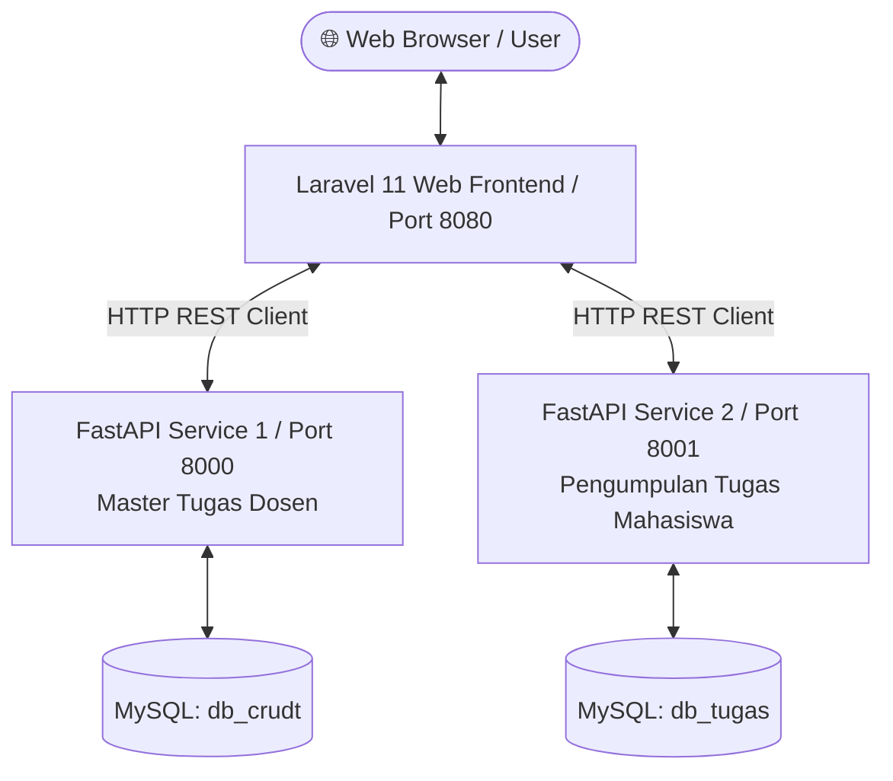

# PKL 2026 — Learning Management System (LMS) & Microservices

<p align="center">
  
  
  
  
</p>

---

## Tentang Proyek

Proyek ini merupakan **Proyek Pertama** hasil kolaborasi tim Praktik Kerja Lapangan (PKL) yang beranggotakan 3 siswa (SMK Negeri 1 Tenggarong) dalam periode **Juli – Agustus 2026**.

Sistem ini dirancang sebagai platform **Learning Management System (LMS) / Pengelola Tugas Kuliah** untuk Fakultas Teknik Universitas Mulawarman (UNMUL) dengan menerapkan **Arsitektur Microservices** yang memisahkan antara frontend web dan layanan backend pengolah data.

---

## Arsitektur Sistem (Microservices)

Sistem ini terdiri dari 3 komponen utama yang saling terhubung:



### Komponen Microservices:
1. **Laravel Web Frontend (Port 8080)**: 
   Aplikasi Web utama berbasis **Laravel 11 + Jetstream (Livewire/Blade) + Tailwind CSS** yang menyajikan antarmuka interaktif bagi mahasiswa dan dosen.
2. **FastAPI Service 1 — Master Tugas (Port 8000)**: 
   Microservice Python (FastAPI + SQLModel) yang menangani CRUD Master Data Tugas Kuliah & Dosen Pengampu (Database: `db_crudt`).
3. **FastAPI Service 2 — Pengumpulan Tugas (Port 8001)**: 
   Microservice Python (FastAPI + SQLModel) yang menangani pengumpulan tugas oleh mahasiswa (Database: `db_tugas`).

---

## Fitur Utama

- **UI Modern & Responsive**: Berbasis Tailwind CSS dengan gaya *Earth & Heritage* (Hijau Hutan & Emas) serta tema *Figma Desktop*.
- **Navigasi Jurusan (Multi-Tab)**: Tab navigasi untuk setiap jurusan Fakultas Teknik UNMUL.
- **Manajemen Tugas Kuliah**: Fitur Tambah, Edit, Hapus, dan Ubah Tugas secara visual.
- **Filter Tugas per Dosen**: Klik Card Dosen untuk memfilter daftar tugas dari dosen tersebut secara *real-time*.
- **Sistem Pengumpulan Tugas Mahasiswa**: Fitur mahasiswa untuk mengumpulkan tugas dan melihat siapa saja yang sudah mengumpulkan.
- **Dual API Connection Status Checker**: Indikator status koneksi *real-time* ke FastAPI Service 1 dan Service 2 di bagian header.

---

## Teknologi yang Digunakan

- **Frontend**: PHP 8.2+, Laravel 11, Blade Templates, Tailwind CSS, Livewire, JavaScript.
- **Backend Services**: Python 3.10+, FastAPI, SQLModel, Uvicorn.
- **Database**: MySQL (PyMySQL / Laragon).
- **Auth & Security**: Laravel Jetstream, Sanctum, Fortify.

---

## Petunjuk Menjalankan Project

### 1. Persiapan Database (MySQL / Laragon)
Pastikan Laragon/MySQL sudah aktif. Buka phpMyAdmin (`http://localhost/phpmyadmin`) dan buat 2 database baru:
1. `db_crudt` (Untuk FastAPI 1 - Master Tugas)
2. `db_tugas` (Untuk FastAPI 2 - Pengumpulan Tugas)

---

### 2. Jalankan FastAPI Service 1 (Port 8000)
Buka Terminal 1:
```bash
cd fastAPI
uvicorn main:app --reload --port 8000
```

---

### 3. Jalankan FastAPI Service 2 (Port 8001)
Buka Terminal 2:
```bash
cd fastAPI2
uvicorn main:app --reload --port 8001
```

---

### 4. Jalankan Laravel Web Server (Port 8080)
Buka Terminal 3:
```bash
php artisan serve --port 8080
```

---

### 5. Akses Aplikasi
Buka browser dan akses alamat berikut:
- **Halaman Utam (Welcome)**: `http://127.0.0.1:8080/`
- **Halaman Tugas Kuliah**: `http://127.0.0.1:8080/tugas`
- **Swagger Documentation API 1**: `http://127.0.0.1:8000/docs`
- **Swagger Documentation API 2**: `http://127.0.0.1:8001/docs`

---

## Tim Praktik Kerja Lapangan (PKL)

- **Asal Sekolah**: SMK Negeri 1 Tenggarong
- **Lokasi Magang**: Fakultas Teknik Universitas Mulawarman (UNMUL)
- **Periode PKL**: Juni – November 2026
- **Anggota Tim**: 3 Orang Siswa PKL

---

<p align="center">
  <i>Dikembangkan sebagai proyek magang pertama berbasis Microservices & Web Development.</i>
</p>
