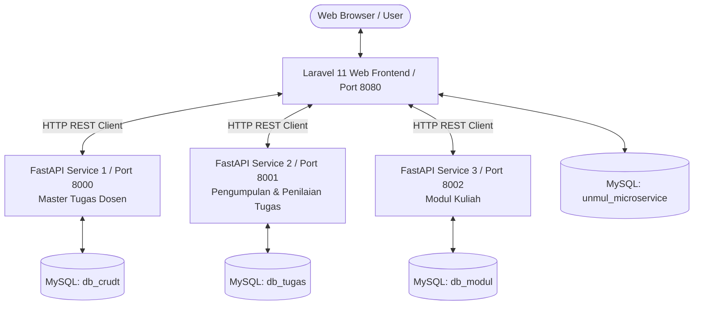

# Learning Management System (LMS) & Microservices

<p align="center">
  
  
  
  
</p>

---

## Tentang Proyek

Proyek ini merupakan **Proyek Pertama** hasil kolaborasi tim Praktik Kerja Lapangan (PKL) yang beranggotakan 3 siswa (SMK Negeri 1 Tenggarong) dalam periode **Juli – Agustus 2026**.

Sistem ini dirancang sebagai platform **Learning Management System (LMS) / Pengelola Tugas & Modul Kuliah** untuk Fakultas Teknik Universitas Mulawarman (UNMUL) dengan menerapkan **Arsitektur Microservices** yang memisahkan antara frontend web dan layanan backend pengolah data.

---

## Arsitektur Sistem (Microservices)

Sistem ini terdiri dari 4 komponen utama yang saling terhubung via HTTP REST API Client:



### Komponen Utama:
1. **Laravel Web Frontend (Port 8080)**: 
   Aplikasi Web utama berbasis **Laravel 11 + Jetstream (Blade) + Tailwind CSS** yang menyajikan antarmuka interaktif, autentikasi pengguna, otorisasi berbasis peran (RBAC), serta pemanggilan REST API ke microservices backend. Database: `unmul_microservice`.
2. **FastAPI Service 1 — Master Tugas (Port 8000)**: 
   Microservice Python (`API_Tugas-Mahasiswa`) berbasis FastAPI & SQLModel untuk mengelola data master tugas kuliah (CRUD Tugas) dari dosen. Database: `db_crudt`.
3. **FastAPI Service 2 — Pengumpulan & Penilaian (Port 8001)**: 
   Microservice Python (`API_Penilaian-Tugas-Mahasiswa`) berbasis FastAPI & SQLModel untuk menangani pengumpulan tugas oleh mahasiswa serta pemberian nilai oleh dosen. Database: `db_tugas`.
4. **FastAPI Service 3 — Modul Kuliah (Port 8002)**: 
   Microservice Python (`API_Modul-Kuliah`) berbasis FastAPI & SQLModel untuk mengelola modul materi perkuliahan (CRUD Modul) yang diunggah oleh dosen. Database: `db_modul`.

---

## Otorisasi Berbasis Peran (Role-Based Access Control / RBAC)

Sistem mengimplementasikan middleware `CheckRole` pada Laravel untuk mengatur hak akses berdasarkan peran pengguna (`role`):

- **Admin**: Akses penuh ke seluruh fitur sistem (Manajemen Tugas, Pengumpulan Tugas, Penilaian, Modul Kuliah) serta **Manajemen Akun** — mendaftarkan, mengubah, dan menghapus akun Mahasiswa/Dosen/Admin melalui Nomor Induk (NIM/NIP).
- **Dosen**: Dapat membuat, memperbarui, dan menghapus Tugas Kuliah; memberikan nilai beserta catatan penilaian pada tugas mahasiswa; serta mengunggah, mengedit, dan menghapus Modul Kuliah.
- **Mahasiswa**: Dapat melihat daftar Tugas Kuliah dan Modul Kuliah, serta mengumpulkan tugas melalui tautan Google Drive / file.

> ⚠️ **Registrasi mandiri (publik) dinonaktifkan.** Akun hanya dapat dibuat oleh **Admin/Operator Fakultas** melalui halaman **Manajemen Akun** (`/admin/pengguna`). Pengguna baru yang mendaftar sebelum fitur ini secara otomatis berperan sebagai *Mahasiswa*.

---

## Fitur Utama Sistem

- **UI Modern & Responsive**: Berbasis Tailwind CSS dengan dukungan **Mode Gelap/Terang** (tersimpan di `localStorage`) serta antarmuka adaptif untuk desktop & mobile.
- **Manajemen Akun oleh Admin (Baru)**: Admin dapat mendaftarkan akun baru lengkap dengan **Nomor Induk (NIM/NIP)**, email, dan role (Mahasiswa/Dosen/Admin), lengkap dengan pencarian real-time, filter per-role, kartu statistik pengguna, edit data, reset password, dan hapus akun.
- **Lupa Password 2 Langkah (Baru)**: Pengguna memasukkan email + NIM/NIP → sistem mengirim **kode verifikasi 6-digit** (berlaku 60 menit) → setelah kode terverifikasi, pengguna dapat membuat password baru.
- **Manajemen Tugas Kuliah**: Fitur Tambah, Edit, Hapus, dan Lihat Tugas Kuliah terintegrasi dengan FastAPI 1 (Port 8000), termasuk filter tugas berdasarkan dosen pengampu.
- **Sistem Pengumpulan & Penilaian + Catatan Dosen**: Mahasiswa dapat mengumpulkan tugas (tautan file), dan Dosen/Admin dapat memberikan nilai (0–100) **beserta catatan/feedback penilaian** terintegrasi dengan FastAPI 2 (Port 8001).
- **Manajemen Modul Kuliah**: Dosen dapat mengunggah modul materi kuliah dan mahasiswa dapat mengunduh / mengaksesnya terintegrasi dengan FastAPI 3 (Port 8002).
- **Triple API Connection Status Checker**: Indikator status koneksi real-time untuk mengecek ketersediaan FastAPI Service 1, Service 2, dan Service 3.

---

## Detail Endpoint Microservices

### Laravel Web Routes (Port 8080, memerlukan login)
- `GET /tugas`: Halaman daftar tugas kuliah.
- `GET /modul`: Halaman daftar modul kuliah.
- `POST/PUT/DELETE /tugas...`: CRUD Tugas (Dosen & Admin).
- `POST /kumpul-tugas`: Pengumpulan tugas mahasiswa (Mahasiswa & Admin).
- `PATCH /kumpul-tugas/{id}/nilai`: Memberi nilai + catatan dosen (Dosen & Admin).
- **Khusus Admin — Manajemen Akun**:
  - `GET /admin/pengguna`: Halaman manajemen akun pengguna.
  - `POST /admin/pengguna`: Mendaftarkan akun baru (`name`, `email`, `nomer_induk`, `role`, `password`).
  - `PUT /admin/pengguna/{id}`: Mengubah data akun / reset password.
  - `DELETE /admin/pengguna/{id}`: Menghapus akun (tidak dapat menghapus akun sendiri).
- **Lupa Password (AJAX, tanpa login)**:
  - `POST /forgot-password/send-code`: Kirim kode verifikasi 6-digit ke email (validasi email + NIM/NIP).
  - `POST /forgot-password/verify-code`: Verifikasi kode (langkah 2).
  - `POST /forgot-password/reset-with-code`: Set password baru dengan kode terverifikasi.

### FastAPI Service 1 — Master Tugas (Port 8000)
- `GET /`: Cek status server.
- `GET /ambil-tugas`: Mengambil daftar seluruh tugas kuliah.
- `POST /tambah`: Menambahkan data tugas baru (`nama_tugas`, `nama_dosen`, `deadline_tugas`).
- `PATCH /edit/{tugas_id}`: Mengubah data tugas berdasarkan ID.
- `DELETE /hapus/{tugas_id}`: Menghapus data tugas berdasarkan ID.

### FastAPI Service 2 — Pengumpulan & Penilaian (Port 8001)
- `GET /`: Cek status server.
- `GET /ambil-kumpul`: Mengambil data seluruh pengumpulan tugas mahasiswa.
- `POST /kumpul-tugas`: Mengumpulkan tugas baru (`id_tugas`, `nama_mahasiswa`, `file_mahasiswa`, `tanggal_kumpul`).
- `PATCH /edit-kumpul/{kumpul_id}`: Mengubah data pengumpulan tugas.
- `PATCH /beri-nilai/{kumpul_id}`: Memberikan nilai pada pengumpulan tugas (`nilai`: 0 - 100, `catatan_dosen`: opsional).
- `DELETE /hapus-kumpul/{kumpul_id}`: Menghapus data pengumpulan tugas.

### FastAPI Service 3 — Modul Kuliah (Port 8002)
- `GET /`: Cek status server.
- `GET /ambil-modul`: Mengambil daftar seluruh modul kuliah.
- `POST /Tambah-modul`: Menambahkan modul baru (`nama_modul`, `nama_dosen`, `file_modul`, `tanggal_diupload`).
- `PATCH /edit-modul/{modul_id}`: Mengubah data modul perkuliahan.
- `DELETE /hapus-modul/{modul_id}`: Menghapus data modul perkuliahan.

---

## Teknologi yang Digunakan

- **Frontend Web**: PHP 8.2+, Laravel 11, Blade Templates, Tailwind CSS, Livewire, JavaScript, Vite.
- **Backend Services**: Python 3.10+, FastAPI, SQLModel, PyMySQL, Uvicorn.
- **Database**: MySQL Server (Laragon / XAMPP).
- **Autentikasi & Keamanan**: Laravel Jetstream, Sanctum, Fortify, Custom RBAC Middleware (`CheckRole`).

---

## Petunjuk Menjalankan Project

### 1. Persiapan Database (MySQL)
Pastikan MySQL Server sudah aktif. Buat 4 database baru di MySQL:
1. `unmul_microservice` (Untuk Web Application Laravel)
2. `db_crudt` (Untuk FastAPI 1 - Master Tugas)
3. `db_tugas` (Untuk FastAPI 2 - Pengumpulan & Penilaian)
4. `db_modul` (Untuk FastAPI 3 - Modul Kuliah)

Perintah SQL via MySQL CLI:
```sql
CREATE DATABASE IF NOT EXISTS unmul_microservice;
CREATE DATABASE IF NOT EXISTS db_crudt;
CREATE DATABASE IF NOT EXISTS db_tugas;
CREATE DATABASE IF NOT EXISTS db_modul;
```

---

### 2. Instalasi Dependency & Konfigurasi Laravel
1. Copy file environment dan sesuaikan konfigurasi database:
   ```bash
   cp .env.example .env
   ```
2. Jalankan instalasi dependensi PHP & JavaScript:
   ```bash
   composer install --ignore-platform-reqs
   npm install
   npm run build
   ```
3. Generate Key & jalankan migrasi database Laravel:
   ```bash
   php artisan key:generate
   php artisan migrate
   ```

---

### 3. Instalasi Dependency Python (Microservices)
Pastikan Python 3.10+ telah terinstal, kemudian jalankan perintah berikut untuk menginstal dependensi yang dibutuhkan oleh ketiga microservice:
```bash
pip install fastapi uvicorn sqlmodel pymysql pydantic
```

---

### 4. Menjalankan Seluruh Service

Buka 4 terminal terpisah untuk menjalankan masing-masing service:

- **Terminal 1 — FastAPI Service 1 (Master Tugas / Port 8000)**:
  ```bash
  cd API_Tugas-Mahasiswa
  python -m uvicorn main:app --reload --port 8000
  ```

- **Terminal 2 — FastAPI Service 2 (Pengumpulan & Penilaian / Port 8001)**:
  ```bash
  cd API_Penilaian-Tugas-Mahasiswa
  python -m uvicorn main:app --reload --port 8001
  ```

- **Terminal 3 — FastAPI Service 3 (Modul Kuliah / Port 8002)**:
  ```bash
  cd API_Modul-Kuliah
  python -m uvicorn main:app --reload --port 8002
  ```

- **Terminal 4 — Laravel Web Server (Port 8080)**:
  ```bash
  php artisan serve --port 8080
  ```

---

### 5. Membuat Akun Admin Pertama
Karena registrasi publik dinonaktifkan, buat akun admin pertama secara manual via Artisan Tinker:
```bash
php artisan tinker
```
```php
App\Models\User::create([
    'name' => 'Operator Fakultas',
    'email' => 'operator@unmul.ac.id',
    'nomer_induk' => 'NIP-OPERATOR-001',
    'role' => 'admin',
    'password' => bcrypt('password-anda'),
]);
```
Setelah login sebagai Admin, akun Mahasiswa/Dosen lain dapat didaftarkan melalui menu **Manajemen Akun** (`/admin/pengguna`).

---

### 6. Akses Aplikasi & Dokumentasi API

Buka browser dan akses alamat berikut:
- **Halaman Utama (Welcome)**: `http://127.0.0.1:8080/`
- **Halaman Login**: `http://127.0.0.1:8080/login`
- **Halaman Tugas Kuliah**: `http://127.0.0.1:8080/tugas`
- **Halaman Modul Kuliah**: `http://127.0.0.1:8080/modul`
- **Manajemen Akun (Admin)**: `http://127.0.0.1:8080/admin/pengguna`
- **Swagger Documentation API 1 (Master Tugas)**: `http://127.0.0.1:8000/docs`
- **Swagger Documentation API 2 (Pengumpulan Tugas)**: `http://127.0.0.1:8001/docs`
- **Swagger Documentation API 3 (Modul Kuliah)**: `http://127.0.0.1:8002/docs`

---

## Tim Praktik Kerja Lapangan (PKL)

- **Asal Sekolah**: SMK Negeri 1 Tenggarong
- **Lokasi Magang**: Fakultas Teknik Universitas Mulawarman (UNMUL)
- **Periode PKL**: Juni – November 2026
- **Anggota Tim**: 3 Orang Siswa PKL

---

<p align="center">
  <i>Dikembangkan sebagai proyek magang pertama berbasis Microservices & Web Development.</i>
</p>
